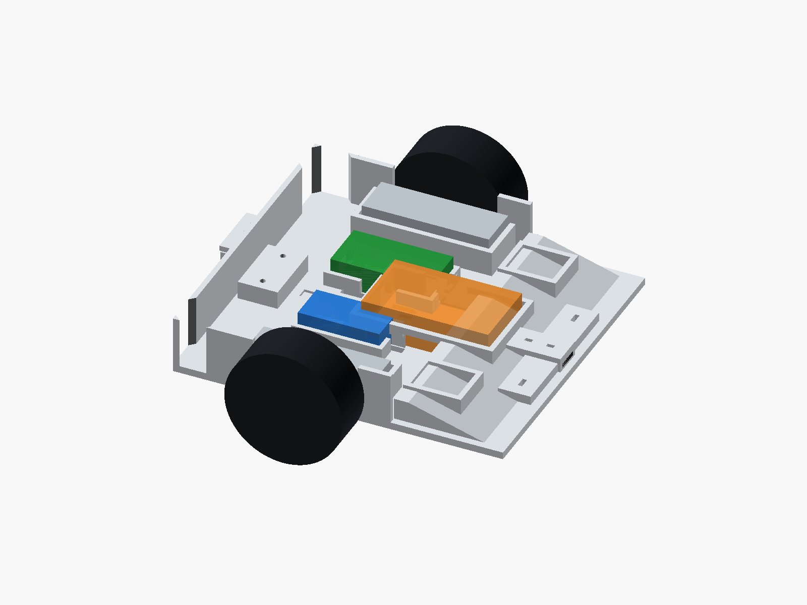

# Sumobot Ghost



`Sumobot Ghost` is a compact sumo-bot chassis project focused on one thing: turning a rough first concept into a mechanically credible fighting robot.

This repo is not just a CAD dump. It tracks:

- the current chassis geometry
- the design reasoning behind it
- the mass and ballast model
- the comparison against stronger reference bots
- the validation workflow needed before any serious redesign

## What This Robot Is Right Now

The current chassis is a serious prototype for the parts on hand, not the final competition architecture.

It is built around:

- `TT` DC gear motors
- `65 x 26 mm` wheels
- `ESP32 DevKit V1`
- `LM2596`
- `7.4V` battery
- `QTR-8RC` line sensor array
- `VL53L0X` front sensor
- internal front ballast bays with printable inserts

Current envelope and mass direction:

- overall envelope: `188 x 168 x 32 mm`
- estimated assembled mass without ballast inserts loaded: about `378 to 456 g`
- estimated assembled mass with the standard `70 g` ballast load and `TB6612` allowance: about `453 to 533 g`

Detailed mass report:
- [sumobot_mass_estimate.md](exports/sumobot_mass_estimate.md)

## What The Design Tries To Achieve

- low front wedge for pushing
- protected internal packaging instead of loose component placement
- service access for wiring, switch, and programming
- tunable front-half ballast without blocking the attack edge
- replaceable rear skid
- clean upgrade path to stronger motors and better wheels later

## Current Design Highlights

- integrated wedge nose
- motor cradles with guides, stops, and strap paths
- battery bay with cable exit logic
- ESP32 and power-module retention features
- sensor mounts in the front module
- wire trenches, pass-throughs, and anchor points
- guarded rocker-switch pocket
- printable ballast inserts for standard `1/4 oz` steel weight segments

Main source:
- [src/sumobot_chassis.py](src/sumobot_chassis.py)

## What Still Matters Most

The biggest open questions are mechanical, not software:

- exact TT motor shaft datum
- real wheel clearance and wheel exposure
- front sensor height and protection
- how much ballast the current drivetrain can actually use
- whether the current retention features survive impact loads

Those are the questions that decide whether this chassis is correct.

## Best Files To Open First

If you want the essence of the project, start here:

- [exports/sumobot_chassis_preview.png](exports/sumobot_chassis_preview.png)
- [src/sumobot_chassis.py](src/sumobot_chassis.py)
- [exports/sumobot_mass_estimate.md](exports/sumobot_mass_estimate.md)
- [references/sumobot_gap_matrix.md](references/sumobot_gap_matrix.md)
- [references/current_design_enhancement_brief.md](references/current_design_enhancement_brief.md)
- [checklists/sumobot_validation_checklist.md](checklists/sumobot_validation_checklist.md)

## Repo Structure

- `src/`
  source CAD and parametric chassis logic
- `exports/`
  generated CAD files, previews, manifest, and mass reports
- `references/`
  design brief, comparison work, and enhancement reasoning
- `checklists/`
  validation workflow and test logging
- `tools/`
  supporting scripts such as FreeCAD import and mass estimation
- `openscad/`
  preview scene

## Key Outputs

Generated files in `exports/`:

- `sumobot_chassis.step`
- `sumobot_chassis.stl`
- `sumobot_chassis.FCStd`
- `sumobot_rear_skid.step`
- `sumobot_rear_skid.stl`
- `sumobot_ballast_insert.step`
- `sumobot_ballast_insert.stl`
- `sumobot_chassis_preview.png`
- `sumobot_chassis_manifest.json`
- `sumobot_mass_estimate.json`
- `sumobot_mass_estimate.md`

## Current Enhancement Direction

Based on the reference comparison, the best improvements for the current chassis are:

- tighten motor retention around the real TT motor geometry
- reduce wheel exposure once the real fit is confirmed
- protect the front module without making the nose bulky
- keep ballast behind the sensor deck and tune it in steps
- preserve the current packaging architecture while preparing for stronger future hardware

Best summary of that work:
- [references/current_design_enhancement_brief.md](references/current_design_enhancement_brief.md)

## Validation Before Redesign

This project should not jump into blind redesign.

Use the checklist:
- [checklists/sumobot_validation_checklist.md](checklists/sumobot_validation_checklist.md)

Use the log:
- [checklists/sumobot_validation_log.csv](checklists/sumobot_validation_log.csv)

The correct test sequence is:

1. verify motor fit and axle height
2. verify wheel contact and opening alignment
3. verify battery, wiring, and switch retention
4. verify sensor position
5. test ballast at `0 g`, `35 g`, and `70 g`

## Tooling

The source CAD is scripted and parametric, with exports for `STEP`, `STL`, and `FCStd`.

Useful commands:

```powershell
.\run_export.ps1
.\run_mass_estimate.ps1
.\run_freecad_import.ps1
.\run_openscad_preview.ps1
```

If the imported FreeCAD model looks empty, use `View -> Fit all`. The `FCStd` file contains an imported solid, not a native sketch-history model.

## Short BOM

- `2x` TT DC gear motor
- `2x` `65 x 26 mm` wheel
- `1x` `7.4V` battery
- `1x` `ESP32 DevKit V1`
- `1x` `LM2596`
- `1x` motor driver board
- `1x` `KCD1` rocker switch
- `1x` `QTR-8RC`
- `1x` `VL53L0X`
- `2x` printed ballast inserts
- `10x` standard `1/4 oz` steel wheel-weight segments

## Current Position

This repo is best understood as a well-structured prototype path:

- good enough to reason about seriously
- honest about what is still uncertain
- ready for physical validation
- ready to evolve into a stronger chassis when the upgraded drivetrain arrives
